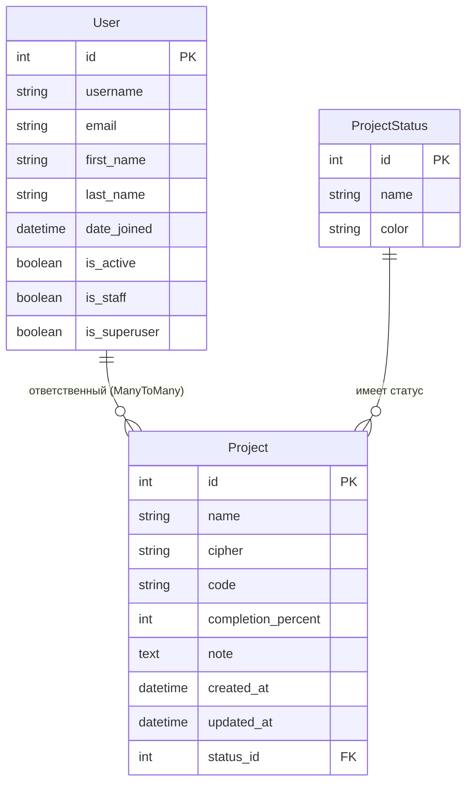

# Блок-схема моделей базы данных

## Диаграмма связей моделей

## Описание моделей

### User
Кастомная модель пользователя, наследуется от AbstractUser Django.
- Связь с Project: ManyToMany (один пользователь может быть ответственным за несколько проектов)

### ProjectStatus
Модель статуса проекта.
- Поля: название, цвет (HEX формат)
- Связь с Project: OneToMany (один статус может быть у многих проектов)

### Project
Модель проекта.
- Поля: имя, шифр, код, процент готовности, примечание, даты создания/обновления
- Связь с ProjectStatus: ForeignKey (каждый проект имеет один статус)
- Связь с User: ManyToMany (у проекта может быть несколько ответственных)

